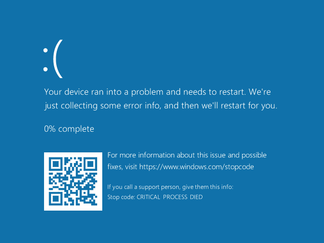

# Chrome Trojan PoC
This malware PoC is an attempt to create a malware that is both difficult to detect and to analyse.

It is meant to masquerade as a legitimate `chrome.exe`, which has also been [uploaded](/Legitimate%20Chrome/chrome.exe) for reference.

> [!IMPORTANT]
> This malware will be flagged by Windows Defender, see [workaround](#workaround-windows-defender).

| MITRE Att&ck Mapping[^1] | Feature | Description |
|----------------------|---------|-------------|
| Execution | Compiled PowerShell Script | Malware is a PowerShell script compiled with [Win-PS2EXE](https://github.com/MScholtes/Win-PS2EXE) [v1.0.1.2](https://github.com/MScholtes/Win-PS2EXE/commit/ebd4f18032bb849204b0b51d5fdcb9105a9180e2). |
| Persistence | Task Scheduler | Malware adds itself to the [Windows Task Scheduler](https://learn.microsoft.com/en-us/windows/win32/taskschd/about-the-task-scheduler) to run when the computer boots up. |
| Stealth | (Invalid) File Signature | Steal an invalid file signature from a legitimate `chrome.exe` using [SigThief](https://github.com/secretsquirrel/SigThief) and attach it to the malware. <sup>Some antivirus do not check signature validity, just that one exists.[^2]</sup> |
| Stealth | Cyrilic Filename | Malware filename contains a cyrilic unicode character[^3] that look identical to ASCII. <sup>e.g. `е` instead of `e`</sup> |
| Stealth | Move File to Path | QoL feature to copy the malware file to the `C:\Program Files\Google\Chrome\Application` folder where Google Chrome is installed. <sup>The Cyrilic character allows copying even if the legitimate `chrome.exe` exists.</sup> |
| Stealth | File Self-Destruction | QoL feature to delete the original file after copying.[^4] |
| Stealth | Change File Icon | Win-PS2EXE allows selecting a `.ico` file for the compiled malware, which can be extracted from the legitimate `chrome.exe` using [Resource Hacker](https://www.angusj.com/resourcehacker). |
| Stealth | Change File Metadata | Resource Hacker can recompile the malware file to change file attributes. <sup>e.g. Language: English (United States)</sup> |
| Stealth | Change File Timestamps | The `CreationTime` and `LastWriteTime` of the malware file is changed to match the legitimate `chrome.exe`. <sup>[details](#step-7-final-modifications)</sup> |
| Stealth | Pad File Size | Pad the file with `0x00` bytes to match the file size of the legitimate `chrome.exe`. |
| Stealth | Obfuscation | Before compilation, manually obfuscate the malware script <sup>[details](#step-1-manual-obfuscation)</sup>, then put the script through [`Invoke-Obfuscation`](https://github.com/danielbohannon/Invoke-Obfuscation). |
| Impact | Denial of Service | The malware restarts the computer, and on subsequent bootups cause a Blue Screen of Death (BSoD)[^5]. <br/><br/> <div>


## How to Run
1. Ensure antivirus is turned off. <br/> 

2. Right-click the malware to `Run as Administrator`, and confirm the popup that appears. <br/> 
> [!TIP]
> To bypass the popup, right-click the malware to view `Properties`.
> 
> Under `Compatability`, ensure `Run this program as an administrator` is checked.
> 
> 

3. After some time, the computer will restart.

<span id="workaround-windows-defender"></span>
> [!NOTE]
> After running the malware once, Windows Defender will not detect and prevent subsequent executions, if user remains on the login screen.


## Stopping the Malware
4. On subsequent bootups, the computer will experience a BSoD and crash.
5. After too many crashes, the computer will boot in Safe Mode. <br/> 
6. <p>While in Safe Mode, under `Advanced Repair Options`, select `Troubleshoot` > `Advanced Options` > `Command Prompt` to delete the malware, stopping the BSoD cycle. <br/> 
7. Finally, delete the [malware task](xml_file.xml) from the Windows Task Scheduler.


## Steps to Compile
> [!NOTE]
> The compiled malware is published under `Releases`.
> 
> These steps are here to provide details if anyone wants to edit the source code and re-compile the malware.
>
> E.g. Masquerade Firefox instead of Chrome.


#### Step 1: Manual Obfuscation
The PowerShell script is manually obfuscated using 4 techniques mentioned in the [PowerShell Obfuscation Bible](https://github.com/t3l3machus/PowerShell-Obfuscation-Bible).

1. **Rename Objects + Reduce Entropy**: <br/> Every variable becomes $ffffffffffffff of different length. Can be improved by having randomised lengths.
2. **Obfuscate Booleans:** <br/> Use built-in variables (e.g. `[System.TimeZoneInfo+AdjustmentRule].IsAnsiClass`) in place of `$true` or `$false`.
3. **Reverse Strings:** <br/> `$hello = '!dlroW olleH'.tochararray()[-1..-100] -join ''`
4. **Obfuscate Commands:** <br/> Using `Get-Command` / `gcm` with reversed strings. <br/> 

> [!NOTE]
> Using wildcards with `gcm` does not work consistently for unknown reasons.


#### Step 2: Invoke-Obfuscation
The subsequent script is passed to the automated obfuscation tool [`Invoke-Obfuscation`](https://github.com/danielbohannon/Invoke-Obfuscation) for further obfuscation.

1. Apply option: `Token > All > 1`
2. Apply option: `Ast > All > 1`

> [!NOTE]
> Originally, more obfuscation techniques were included, but were flagged by the antivirus for being too aggressive.
> 
> This was when the malware was less aggressive, and did not have Persistence or Self-Deletion, and was meant to be more covert.
>
> Depending on your scenario, you can add more obfuscation techniques, or remove the 2 features mentioned, to prevent being flagged by the antivirus.


#### Step 2.5: Handling Garbage Output
The PowerShell script contains 2 Cyrillic 'е's <sup>(see [step 7](#step-7-final-modifications))</sup>, which is replaced by the `"?"` character after being passed through `Invoke-Obfuscation`, and have to be manually replaced after.


#### Step 3: Compile to Executable
The PowerShell script is compiled into an executable using [Win-PS2EXE](https://github.com/MScholtes/Win-PS2EXE) [v1.0.1.2](https://github.com/MScholtes/Win-PS2EXE/commit/ebd4f18032bb849204b0b51d5fdcb9105a9180e2), with the following inputs and options:

<ins><b>Input</b></ins>

| Label | Value | Notes |
| ----- | :---: | ----- |
| Source File | `chrome.ps1` | Rename the malware file to this before compilation, as in testing it shows up during static analysis.
| Icon File | `*.ico` | `.ico` file extracted from legitimate `chrome.exe` via Resource Hacker <sup>(see [step 4](#step-4-modify-metadata))</sup>.
| Version, File Description, Product Name | ??? | Copy from the legitimate `chrome.exe`, using the command `Get-ChildItem ".\chrome.exe" \| Format-List`. |
| Copyright | ??? | Copy from the legitimate `chrome.exe`, using the command `(Get-Item ".\chrome.exe").VersionInfo.LegalCopyright`. |

<ins>**Options**</ins> <sup>Default values otherwise</sup>

| Label | Value |
| ----- | :---: |
| Compile a graphic windows program (parameter -noConsole) | <input type="checkbox" checked> |
| Suppress output (-noOutput) | <input type="checkbox" checked> |
| Suppress error output (-noError) | <input type="checkbox" checked> |
| Platform | `x64` |

<div style="height: calc(1.5rem - 16px)"></div>

> [!WARNING]
> Test running the executable before carrying on. There is a chance `Invoke-Obfuscation` can break the code.


#### Step 4: Modify Metadata
Use [Resource Hacker](https://www.angusj.com/resourcehacker) to open the legitimate `chrome.exe`:
- Under `Icon` / `Icon Group`, find the file icon resource, right click and select `Save *.ico resource...` to use in step 3.
- Under `Version Info`, copy the details enclosed within the `BLOCK "StringFileInfo" { ... }` and `BLOCK "VarFileInfo" { ... }` sections.

Then, open the compiled malware file in Resource Hacker:
- Under `Version Info`, replace the details with those extracted from `chrome.exe`.


#### Step 5: Sign Executable
Sign the malware with an **invalid** code signing certificate using [SigThief](https://github.com/secretsquirrel/SigThief).
```powershell
py .\sigthief.py -i "C:\Program Files\Google\Chrome\Application\chrome.exe" -t ".\6-metadata.exe" -o ".\7-signed-testing.exe"
```


#### Step 6: Pad File
Run the following PowerShell script to pad the malware file with empty bytes.

> [!IMPORTANT]
> Padding the signed file breaks the signature, and Windows cannot register it.
> 
> Use the signed file to calculate the bytes needed for padding, pad the unsigned file, *then* sign it again.

```powershell
$chromeFileSize = (Get-Item "C:\Program Files\Google\Chrome\Application\chrome.exe").Length
$signedFileSize = (Get-Item ".\7-signed-testing.exe").Length
$bytesToAdd = $chromeFileSize - $signedFileSize

$unsignedFile = ".\6-metadata.exe"
$outputFile = ".\8-padded.exe"

$zeroBytes = New-Object byte[] $bytesToAdd # Adds "0x00"
Copy-Item -Path $unsignedFile -Destination $outputFile
[System.IO.File]::Open($outputFile, "Append").Write($zeroBytes, 0, $bytesToAdd)

# Then, sign `padded-file.exe` with the command from step 6.
# CMD has an issue with releasing the file, so close and re-open the terminal before running the next command. 
py .\sigthief.py -i "C:\Program Files\Google\Chrome\Application\chrome.exe" -t ".\8-padded.exe" -o ".\9-signed.exe"
```


#### Step 7: Final Modifications
Run the following PowerShell command to modify the malware's creation and modification time.

> [!IMPORTANT]
> Make sure not to make any changes to the malware after this point.

```powershell
$chromeFile = "C:\Program Files\Google\Chrome\Application\chrome.exe"
$signedFile = ".\9-signed.exe"
(Get-Item $signedFile).CreationTime = (Get-Item $chromeFile).CreationTime
(Get-Item $signedFile).LastWriteTime = (Get-Item $chromeFile).LastWriteTime
```

Finally, rename the file with a cyrilic character (in this case, "е").
```powershell
Move-Item -Path ".\9-signed.exe" -Destination "C:\Program Files\Google\Chrome\Application\chromе.exe"
```

[^1]: https://attack.mitre.org
[^2]: https://github.com/secretsquirrel/SigThief#what-is-this
[^3]: https://en.wikipedia.org/wiki/Cyrillic_script_in_Unicode
[^4]: Credit to https://stackoverflow.com/questions/1606140/how-can-a-program-delete-its-own-executable/1606189#1606189 and https://www.catch22.net/tuts/system/self-deleting-executables/#the-movefileex-method.
[^5]: Adapted from https://github.com/PowerShellMafia/PowerSploit/blob/master/Mayhem/Mayhem.psm1#L268